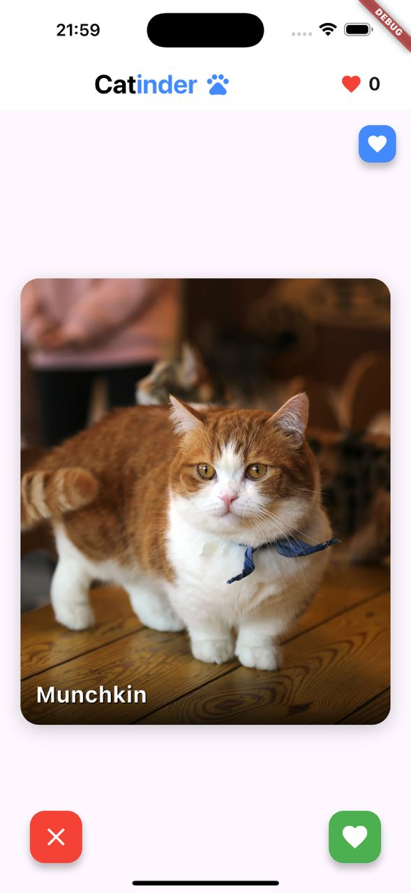
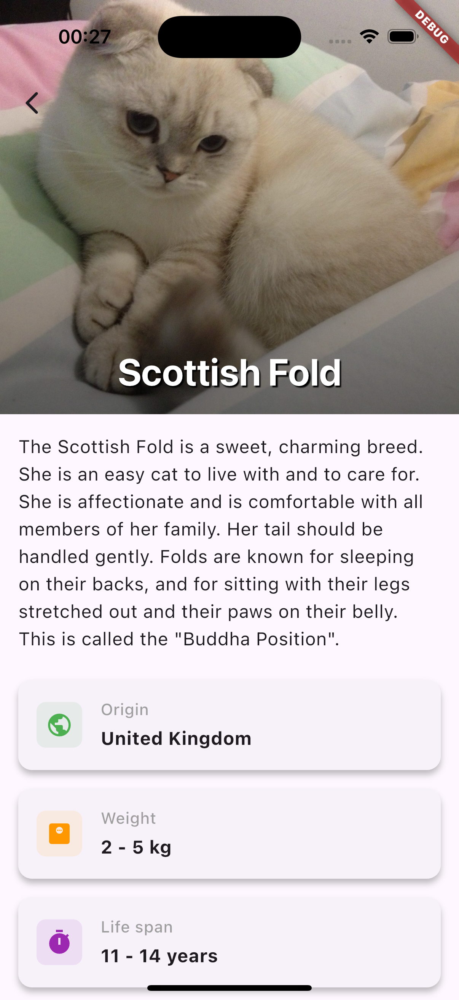
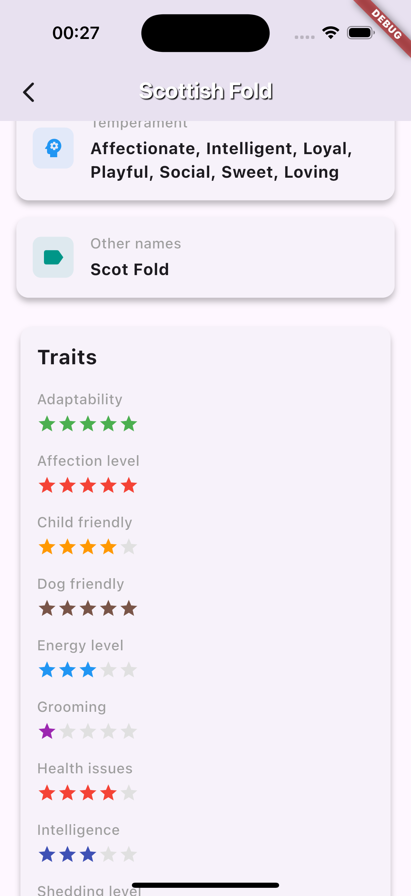
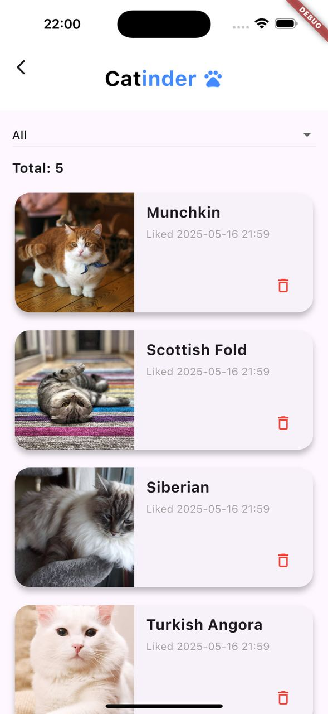
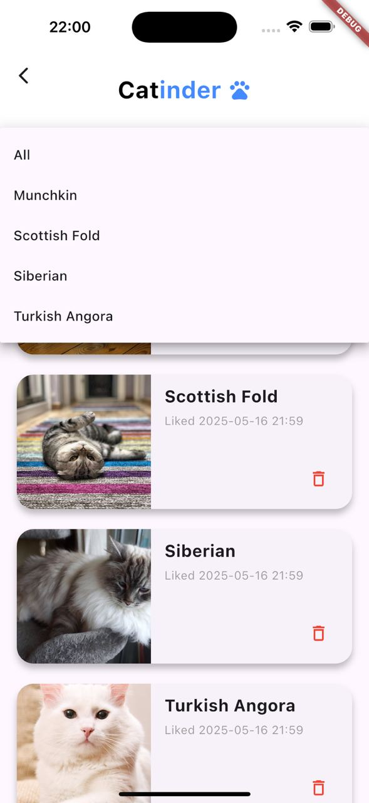
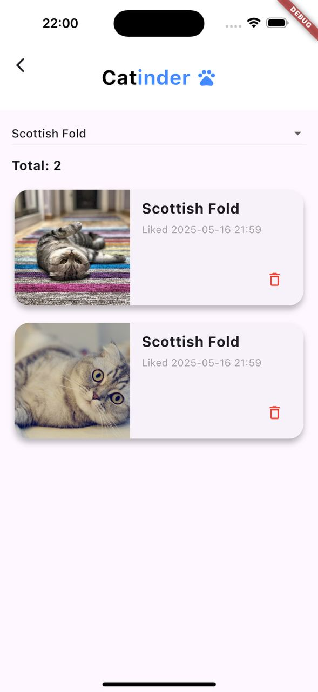

# Catinder 🐱

## Описание

Catinder - приложение с концепцией Tinder, где вместо людей - котики. Пользователь свайпает понравившихся котиков вправо, а не понравившихся скипает свайпом влево. Работа выполнена в рамках домашнего задания по дисциплине **Кроссплатформенная разработка на Flutter // ВШЭ 2025**.

В рамках домашнего задания №2 был добавлен экран с понравившимися котиками: в него попадают все лайкнутые на основном экране коты. Новый экран реализован в виде скроллящегося списка с карточками котиков. Карточку можно удалить. Нажатие по карточке переводит на экран с детальной информацией
о котике. На экране реализована поддержка фильтров.

Выполнила: Серикова Виктория 

## Реализованные фичи

### Основные фичи из ДЗ №1
- [x] На главный экран подгружаются котики, отображается фотография котика и его порода
- [x] Изображение свайпается (влево - дизлайк, вправо - лайк)
- [x] Есть кнопки лайка и дизлайка (лайкают и дизлайкают 😮)
- [x] Свайп или нажатие на кнопки лайка/дизлайка подгружает нового котика
- [x] Счетчик лайков (с анимацией)
- [x] Реализован экран с детальной информацией о котике, открывается по тапу на фотографию
- [x] На детальном экране отображается вся информация о породе котика, доступная через api.
- [x] Сделана кастомная иконка приложения
      
### Основные фичи из ДЗ №2
- [x] Экран "Liked cats" со списком всех лайкнутых котиков
- [x] Хранение лайков в рантайме в local_liked_cat_datasource
- [x] В списке лайкнутых котиков отображаются карточки с фотографией, названием породы и датой лайка котика
- [x] Реализовано удаление котика из списка лайкнутых через кнопку корзины
- [x] Реализована фильтрация по породе через выпадающий список с мгновенным обновлением
- [x] При длительной загрузке показывается CircularProgressIndicator
- [x] При сетевой ошибке показывается AlertDialog с текстом ошибки
- [x] Синхронизирован счетчик лайков на главном экране с добавлением и удалением котика из списка лайкнутых: если убрать котика из списка на экране лайкнутых котиков, то и счетчик лайков на главном экране уменьшится
- [x] Тап по карточке в списке лайкнутых котиков переводит на экран с детальной информацией о котике
- [x] Лайки и дизлайки отправляют запросы на api по ручке vote

### Реализованные технические требования
- [x] Декомпозиция на слои data, domain, presentation
- [x] Управление состоянием через Cubit
- [x] DI через get_it
- [x] CircularProgressIndicator для загрузки изображения, AlertDialog для ошибок сети

## 📱 Скриншоты
<p>
  
  
  
</p>

<p>
  
  
  
</p>
<p>
  
  
</p>

# Скачивание APK
[Ссылка на скачивание APK (Гугл Диск)](https://drive.google.com/drive/folders/1sJeX5z1i_hTVO-Hg10XhiWr0oM5OXuYy?usp=sharing)


## 🚀 Установка и запуск

1. Необходим Flutter SDK
2. Склонируйте репозиторий:
```bash
git clone https://github.com/badbebrik/Catinder.git
```
3. Перейдите в директорию проекта:
```bash
cd catinder
```
4. Создайте файл .env в корневой директории проекта:
```bash
touch .env
```
5. Добавьте в файл .env следующую строку с API ключом:
```
CAT_API_KEY="your_api_key_here"
```
6. Установите зависимости:
```bash
flutter pub get
```
7. Запустите приложение:
```bash
flutter run
```

⚠️ : Могу дать свой ключ tg: @badbebrik
