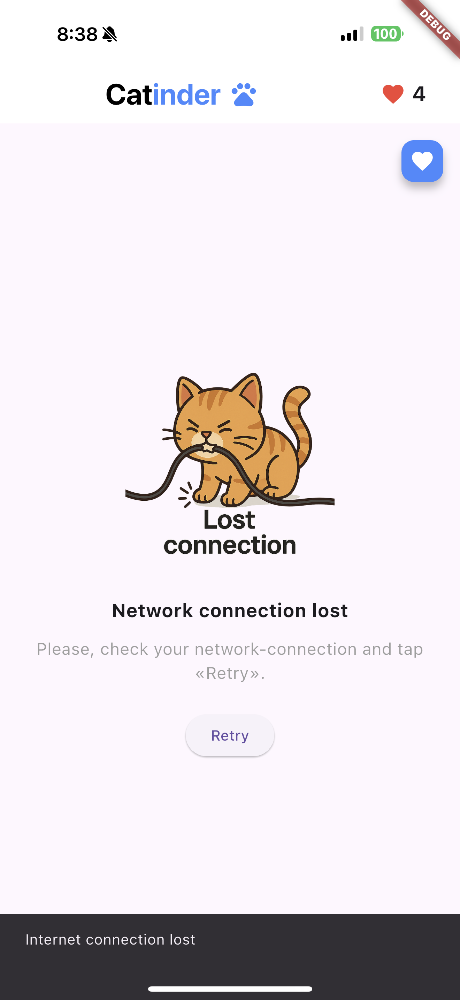
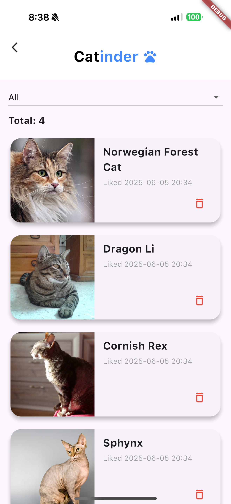
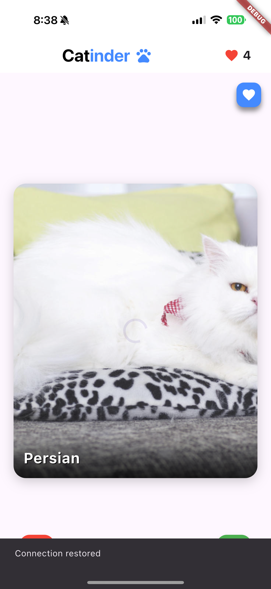

# Catinder 🐱

## Описание

Catinder - приложение с концепцией Tinder, где вместо людей - котики. Пользователь свайпает понравившихся котиков вправо, а не понравившихся скипает свайпом влево. Работа выполнена в рамках домашнего задания по дисциплине **Кроссплатформенная разработка на Flutter // ВШЭ 2025**.

В рамках домашнего задания №2 был добавлен экран с понравившимися котиками: в него попадают все лайкнутые на основном экране коты. Новый экран реализован в виде скроллящегося списка с карточками котиков. Карточку можно удалить. Нажатие по карточке переводит на экран с детальной информацией
о котике. На экране реализована поддержка фильтров.

В рамках домашнего задания №3 был добавлен оффлайн режим с кэшированием фотографий котико и хранением данных на устройстве. Была добавлена проверка подключения к интернету. Написаны тесты.

Выполнила: Серикова Виктория 

## Реализованные фичи

### Основные фичи из ДЗ №1
- [x] На главный экран подгружаются котики, отображается фотография котика и его порода
- [x] Изображение свайпается (влево - дизлайк, вправо - лайк)
- [x] Есть кнопки лайка и дизлайка (лайкают и дизлайкают 😮)
- [x] Свайп или нажатие на кнопки лайка/дизлайка подгружает нового котика
- [x] Счетчик лайков (с анимацией)
- [x] Реализован экран с детальной информацией о котике, открывается по тапу на фотографию
- [x] На детальном экране отображается вся информация о породе котика, доступная через api.
- [x] Сделана кастомная иконка приложения
      
### Основные фичи из ДЗ №2
- [x] Экран "Liked cats" со списком всех лайкнутых котиков
- [x] Хранение лайков в рантайме в local_liked_cat_datasource
- [x] В списке лайкнутых котиков отображаются карточки с фотографией, названием породы и датой лайка котика
- [x] Реализовано удаление котика из списка лайкнутых через кнопку корзины
- [x] Реализована фильтрация по породе через выпадающий список с мгновенным обновлением
- [x] При длительной загрузке показывается CircularProgressIndicator
- [x] При сетевой ошибке показывается AlertDialog с текстом ошибки
- [x] Синхронизирован счетчик лайков на главном экране с добавлением и удалением котика из списка лайкнутых: если убрать котика из списка на экране лайкнутых котиков, то и счетчик лайков на главном экране уменьшится
- [x] Тап по карточке в списке лайкнутых котиков переводит на экран с детальной информацией о котике
- [x] Лайки и дизлайки отправляют запросы на api по ручке vote

### Реализованные технические требования из ДЗ №2
- [x] Декомпозиция на слои data, domain, presentation
- [x] Управление состоянием через Cubit
- [x] DI через get_it
- [x] CircularProgressIndicator для загрузки изображения, AlertDialog для ошибок сети

### Основные фичи из ДЗ №3
- [x] Приложение работает в оффлайн-режиме: отображает ранее загруженных котиков, хранение реализовано через Drift.
- [x] Лайки/дизлайки сохраняются между выходами из приложения.
- [x] Изображения котиков кэшируются и доступны без сети.
- [x] Когда нет сети — это отображается неблокирующим образом в интерфейсе с помощью снекбара.

### Реализованные технические требования из ДЗ №3
- [x] Использование локального хранилища (Drift).
- [x] Интеграция кэширования изображений через `cached_network_image`.
- [x] Написаны unit-тесты на стейт-менеджеры — на операции лайков и дизлайков.
- [x] Используется мокирование (через mockito) для классов, работающих с API и с базой данных.
- [x] Используется пакет connectivity_plus для проверки наличия сети.
- [x] Используется Snackbar для отображения статуса сети.

## 📱 Скриншоты
<p>
  
  
  
</p>

<p>
  
  
  
</p>
<p>
  
  
</p>

## 📱 Скриншоты ДЗ №3
Потеря соединения, локальные данные в оффлайн режиме (и закешированные фото), восстановление сети
<p>
  
  
  
</p>

# Важно !!!
Приложение тестировалось на реальном устройстве (iOS) в связи с тем, что симуляторы выдавали некорретное поведение проверки сети, не реагировали на выключение интернета. На реальном устройстве все работает так, как ожидается. 
Пожалуйста, запускайте приложение на реальном девайсе, так как на симуляторе скорее всего вы увидете некорректное поведение.

# Ссылка на демонстрацию работы приложения
[Демо](https://drive.google.com/drive/folders/1ENGK5i8fBNidPq6Y8dk23_BPYGuhxaVM) 


# Скачивание APK
[Ссылка на скачивание APK (Гугл Диск)](https://drive.google.com/drive/folders/1sJeX5z1i_hTVO-Hg10XhiWr0oM5OXuYy?usp=sharing) В папке apk_hw3


## 🚀 Установка и запуск

1. Необходим Flutter SDK
2. Склонируйте репозиторий:
```bash
git clone https://github.com/badbebrik/Catinder.git
```
3. Перейдите в директорию проекта:
```bash
cd catinder
```
4. Создайте файл .env в корневой директории проекта:
```bash
touch .env
```
5. Добавьте в файл .env следующую строку с API ключом:
```
CAT_API_KEY="your_api_key_here"
```
6. Установите зависимости:
```bash
flutter pub get
```
7. Запустите приложение:
```bash
flutter run
```

⚠️ : Могу дать свой ключ tg: @badbebrik
