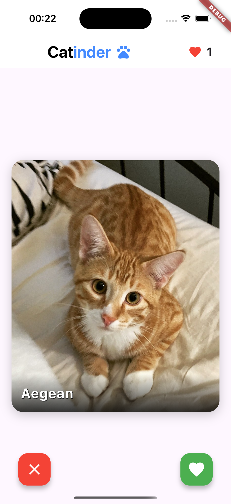
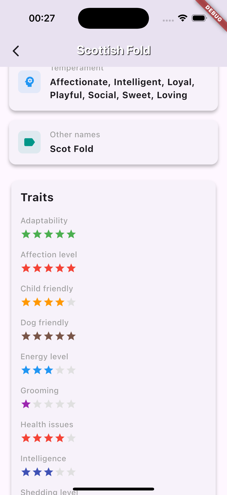

# Catinder 🐱

## Описание

Catinder - приложение с концепцией Tinder, где вместо людей - котики. Пользователь свайпает понравившихся котиков вправо, а не понравившихся скипает свайпом влево. Работа выполнена в рамках домашнего задания по дисциплине **Кроссплатформенная разработка на Flutter // ВШЭ 2025**

Выполнила: Серикова Виктория 

## Реализованные фичи

### Основные фичи
- [x] На главный экран подгружаются котики, отображается фотография котика и его порода
- [x] Изображение свайпается (влево - дизлайк, вправо - лайк)
- [x] Есть кнопки лайка и дизлайка (лайкают и дизлайкают 😮)
- [x] Свайп или нажатие на кнопки лайка/дизлайка подгружает нового котика
- [x] Счетчик лайков (с анимацией)
- [x] Реализован экран с детальной информацией о котике, открывается по тапу на фотографию
- [x] На детальном экране отображается вся информация о породе котика, доступная через api. 


## 📱 Скриншоты




# Скачивание APK
[Ссылка на скачивание APK (Гугл Диск)](https://drive.google.com/file/d/109AT5xz7T5Io-vp9ywId26G1m3kLeQ5b/view?usp=sharing)


## 🚀 Установка и запуск

1. Необходим Flutter SDK
2. Склонируйте репозиторий:
```bash
git clone https://github.com/badbebrik/Catinder.git
```
3. Перейдите в директорию проекта:
```bash
cd catinder
```
4. Создайте файл .env в корневой директории проекта:
```bash
touch .env
```
5. Добавьте в файл .env следующую строку с API ключом:
```
CAT_API_KEY="your_api_key_here"
```
6. Установите зависимости:
```bash
flutter pub get
```
7. Запустите приложение:
```bash
flutter run
```

⚠️ : Могу дать свой ключ tg: @badbebrik
